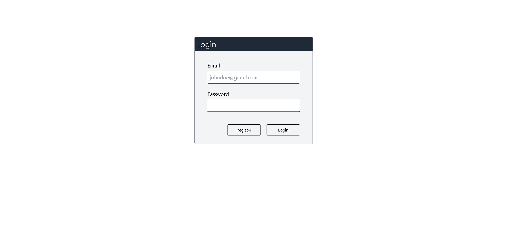
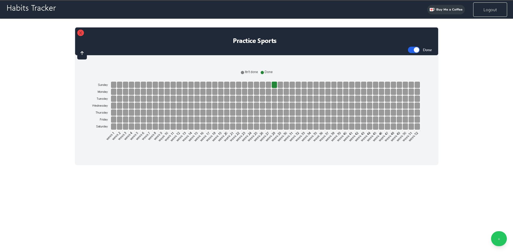

# Habits Tracker




## Description
Habits Tracker is a web application developed with Angular and Appwrite that allows users to track their daily habits. Users can create, update, and delete habits, as well as view their progress over time.

## Features
- **User Authentication:** Users can register, log in, and log out.
- **Habit Management:** Users can add, edit, and delete habits.
- **Progress Tracking:** Users can mark habits as completed and view their progress history.
- **Intuitive Interface:** The application features a user-friendly interface.

## Technologies Used
- **Angular:** Frontend framework.
- **Appwrite:** Backend platform providing services like authentication, database, and storage.
- **TypeScript:** Programming language used for the application development.
- **HTML and CSS:** Technologies used for the structure and design of the user interface.

## Installation and Setup

### Prerequisites
- Node.js (version 20 or higher)
- Angular CLI

### Installation Steps

1. **Clone the repository:**
    ```sh
    git clone https://github.com/your_username/habits-tracker.git
    cd habits-tracker
    ```

2. **Install dependencies:**
    ```sh
    npm install --force
    ```

3. **Set up Appwrite:**
   - Follow the instructions in the [official Appwrite documentation](https://appwrite.io/docs) to set up the Appwrite server using Docker.
   - Create a new project in Appwrite.
   - Configure authentication and the database as needed.

4. **Configure environment variables:**
   - Create an .env file in the root directory and add your Appwrite configuration details:
     ```env
      ENDPOINT=https://cloud.appwrite.io/v1 # or your own Appwrite server
      PROJECT_ID=your-project-id
      DATABASE_ID=database-id
     ```

5. **Start the Angular application:**
    ```sh
    ng serve
    ```

6. **Open the application in the browser:**
    - Visit `http://localhost:4200` in your preferred browser.

## Usage

1. **Registration and Login:**
   - Create an account or log in with an existing account.

2. **Habit Management:**
   - Add new habits using the habit creation form.
   - Edit or delete existing habits from the habits list.

3. **Progress Tracking:**
   - Mark habits as completed to track daily progress.
   - View the history of completed habits.

## Contribution

1. **Fork the repository**
2. **Create a feature branch:**
    ```sh
    git checkout -b feature/new-feature
    ```
3. **Commit your changes:**
    ```sh
    git commit -m 'Add new feature'
    ```
4. **Push to the remote branch:**
    ```sh
    git push origin feature/new-feature
    ```
5. **Create a Pull Request**

## License

This project is licensed under the MIT License. See the [LICENSE](LICENSE) file for details.

## Contact

- **Name:** Fernando Castellanos
- **GitHub:** [fernacas-dev](https://github.com/fernacas-dev)

